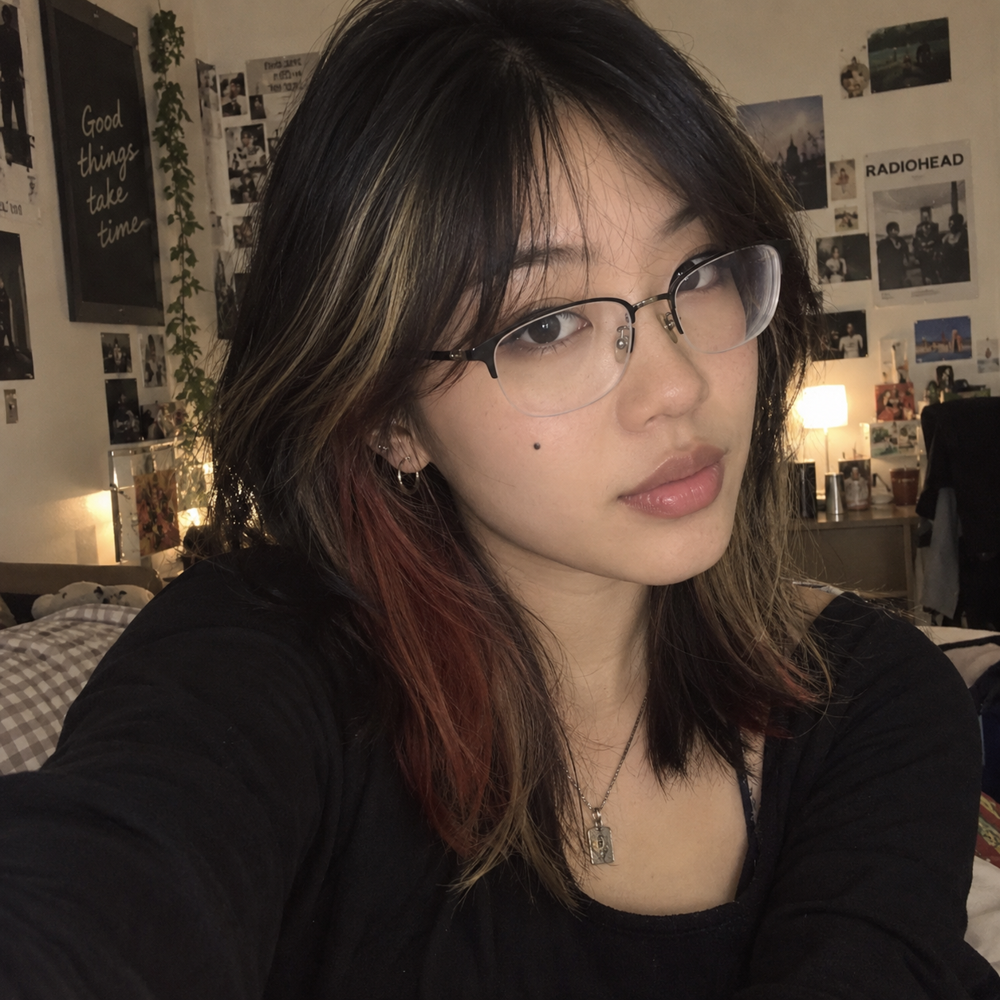
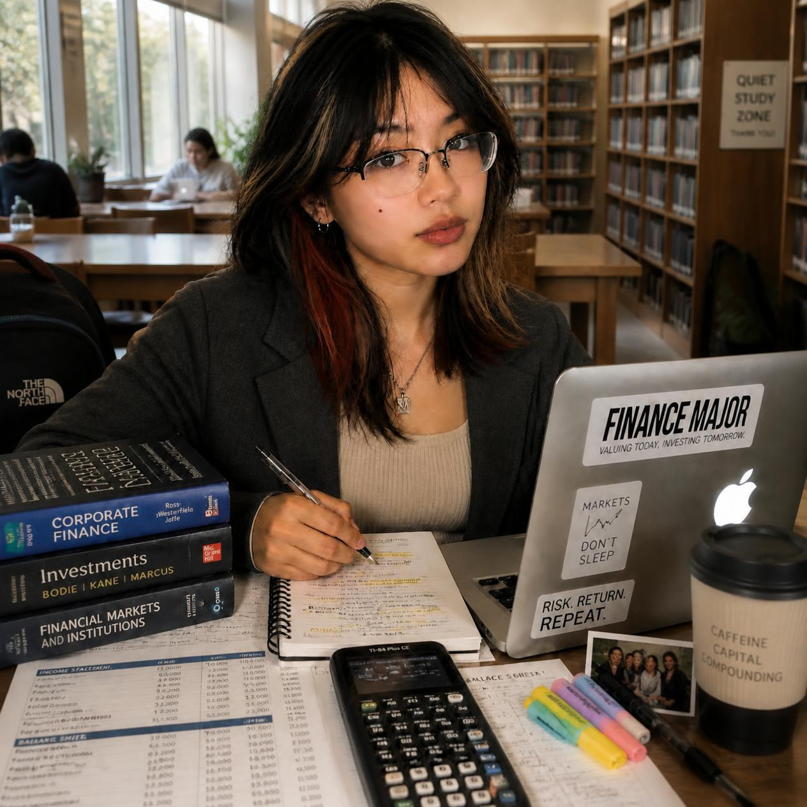

# Week 3 – Selfie & Identity

## The Artifact

### Image 1: AI-Generated Selfie

### Image 2: Remixed Selfie

## Process Notes

Image 1: AI-Generated Selfie
For the first image, I used DALL·E and described some specific parts of my appearance; that I am a Vietnamese/Asian girl in my early 20s, with semi-rimmed glasses, a mole on my right cheek, and shoulder-length black hair with dark blonde highlights and reddish-orange underdye. The AI followed the description fairly closely when it came to my hair, glasses, and mole, but it had to improvise most of my face and surroundings.
Image 2: Remixed Selfie
For the second version, I used Canva AI and added that I am a Financial Economics student. The image changed the setting to a library and added finance textbooks, a calculator, a MacBook, coffee, notes, and a more business-casual outfit. I wanted to see how adding one more piece of information about myself would change the identity the AI created.

## Reflection
The first thing I noticed about the AI selfie was that the hair actually looked pretty close to mine. That makes sense because I gave the AI a lot of specific details about my hair, glasses, and mole. The face was a different story. Besides saying that I was an Asian girl in my early 20s, I did not give it any information about my facial features, so it basically filled in the blanks itself. What it gave me looked like a very generic “good-looking” Asian girl you might see on Pinterest or Instagram. It looks “believable”, but I did not really see myself in the face.
The background was also interesting because I never told it anything about my interests or personality. Since I mentioned my dyed hair, it created a room with posters, plants, warm lighting, and an alternative aesthetic. The Radiohead poster and overall room gave me the impression that the AI was assuming that someone with this kind of hair must also like alternative or “sad” music. It felt like a small stereotype based on appearance, showing how quickly AI can connect one physical detail to a whole personality or aesthetic.
The second image showed another kind of assumption. When I told Canva AI that I was a Financial Economics student, it turned that one fact into an entire lifestyle: a library, finance textbooks, a calculator, a MacBook, coffee, and business-casual clothes. Some of these things are realistic, but together they feel more like a stereotype of a finance student than a representation of me.
I think I see myself in the details I intentionally gave the AI, but not necessarily in the identity it built around them. The images made me realize that AI can take a few pieces of information about someone and fill in everything else using patterns of what it thinks that person should look like.

## Attribution & AI Use
AI Tool Used: DALL·E (via ChatGPT) 
Prompt (summary): “Generate a picture of an Asian (Vietnamese) girl in her early 20s, with semi-rimmed glasses, one mole on right cheek, black hair shoulder length with dark blonde highlights and red-ish orange underdye.”
AI Output: Generated the initial portrait image
My Contribution: Selected the image, edited it in Canva, added a piece of information that I’m a Financial Economics major. 
Notes: I did not upload a real photo of myself to the AI system. 
